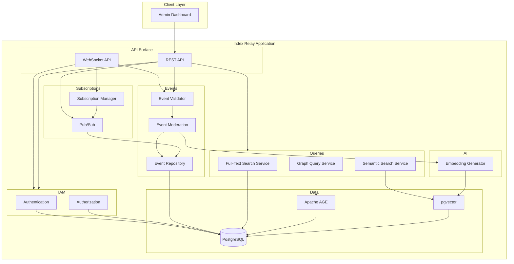

# PRD-1: Index Relay

A general-purpose Nostr relay with specializations that serve the needs of the Alexandria application.

## Market

### Customer Base

The Index Relay is intended to serve three types of customers:

1. **GitCitadel.** The relay will store the event kinds required by Alexandria, including publications indexes (kind 30040), publication fragments (kind 30041), and conversation threads (kinds 11 and 1111). It will allow graph queries to support efficient publication retrieval and visualization, and it will store and serve event embeddings to enable AI-powered semantic search.
2. **Nostr App Developers.** The relay will provide both a NIP-01-compliant WebSocket API and a well-structured REST API. The REST API will exclusively support full-text searches, graph queries, and semantic search. The REST API will provide a low-friction on-ramp for developers wishing to build apps for Nostr, especially those leveraging AI for coding tasks.
3. **Nostr Users.** The relay will act as an event and profile data store for Nostr users who trust the GitCitadel brand and mission. Users of the Index Relay can expect an environment free of spam, pornography, and other abusive content.

### Monetization

The Index Relay will provide a mixture of free and paid services.

#### Free Services

- **Standard Nostr WebSocket API.** Nostr app developers are free to use the Index Relay's WebSocket API within reasonable limits.
- **Basic REST API.** Standard Nostr relay features exposed over the WebSocket API are mirrored on the REST API. App developers are free to use this API within reasonable limits.
- **Outbox Usage.** Any trusted Nostr user can publish events to the relay. Long-term storage is not guaranteed.

#### Paid Services

- **User Profile Directory.** Permanent, guaranteed profile data storage for paid Nostr users. This allows Index Relay to serve as a profile data bootstrap relay for users logging onto new Nostr apps.
- **Long-Term Storage.** Paid Nostr users receive guaranteed long-term storage of their published events. Events published by unpaid users may be deleted periodically to keep data storage costs down.
- **Inbox Usage.** Index Relay will guarantee long-term storage of events that tag Nostr users whose profiles are stored in the relay. This allows Nostr users to designate Index Relay as an inbox.
- **Advanced REST API.** Advanced relay features—full-text search, semantic search, and graph queries—are exposed only over the REST API. App developers using these features must pay to obtain API keys to access these features.
- **Event Revision History.** Previous revisions of replaceable events are retained to allow users to see the change history of their documents, wiki articles, or other publications.

## Functional Requirements

Functional requirements are divided into phases. Higher-priority requirements should be met in earlier phases. This allows the relay to go live sooner, and gradually add capabilities.

### Phase 1

Support Alexandria's core capability set.

- Long-term storage of:
  - Kind 30040 and 30041 publication events
  - Kind 11 and 1111 comment thread events
  - Kind 0 user profile events
  - Kind 30-33 citation events
  - Kind 30817 and 30818 wiki events
- REST API support for:
  - Full publication retrieval
  - Full comment thread retrieval
  - Single event publication and retrieval
  - User profile CRUD operations
- REST API access requires API keys

### Phase 2

Support general-purpose Nostr use cases.

- WebSocket API compliant with NIP-01
- NIP-42 authentication
- Nostr pubkey premium user list and block list
- Abusive content filtering
- Automatic deletion of old events
  - Events signed by pubkeys that have a kind 0 profile on the relay are exempted
- Support negentropy sync with other relays

### Phase 3

Add administrative features.

- Admin dashboard that supports:
  - Adding pubkeys to a block list
  - Adding pubkeys to the premium user list
  - Deleting events by ID or address

### Phase 4

Expand the REST API to support premium features.

- Full-text search of event contents and relevant tags (including title and author)
- Dynamic graph queries
- Previous version retention for replaceable events

### Phase 5

Support artificial intelligence workloads.

- Storage of event embeddings
- Retrieval of event embeddings in signed ephemeral events via WebSocket API
- Semantic search over stored embeddings via REST API

## Non-Functional Requirements

- Response timings and error traces from the production deployment of the relay must be _observable_.
- The system must be vertically _scalable_.
  - Provisioning more resources on a single instance must allow the relay to support larger workloads.
  - Horizontal scalability is a nice-to-have, but we should not over-index on distributed processing early in development.
- The relay must be _responsive_.
  - Publications of 10,000 events should return in 2 seconds or less.
  - Single events fetched by ID or address should return in 0.2 seconds or less.
- The relay must support high _concurrency_, with large numbers of clients using the relay simultaneously.
- The relay must be _fault-tolerant_, such that failed transactions are cleanly rolled back to avoid database corruption.
- The relay must be _correct_.
  - Unauthorized users must be rejected.
  - Events with invalid IDs or signatures must be rejected.
  - Unpaid users must not be able to access paid features.
- Transactions must be properly _isolated_ from one another to ensure consistency.
- The relay must support _pub/sub_ patterns for ephemeral events and long-running client subscriptions.
- The relay's database must work with _graph_ data to efficiently traverse Nostr event networks.
- The relay's database must work with _relational_ data to efficiently handle Nostr filter queries.
- The relay must tend towards being _complete_ within its domain.
  - To support this, the relay should implement the Negentropy protocol described in [NIP-77](https://github.com/nostr-protocol/nips/blob/master/77.md).
  - The relay should synchronize with trusted third-party relays to compare its event collection and retrieve missing events.

## Architecture

### System Diagram

